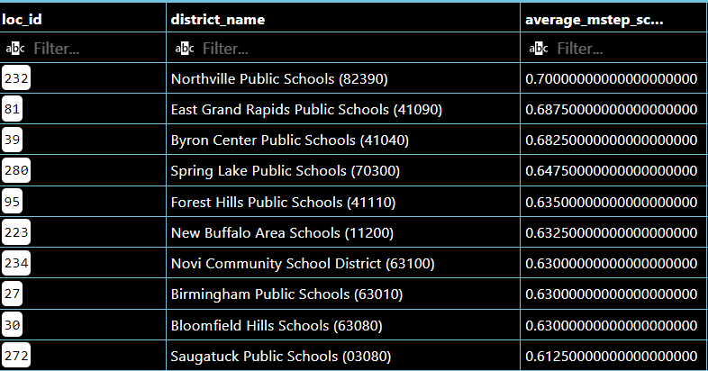

# Michigan Schools Data Project
I wanted to work on this project because, as a teacher, I often find many decisions are made (for one reason or another) and I am looking to dig deeper to see if staffing decisions can be adjusted according to the data.
## Hypothesis
As I begin to analyze the data, I am hypothesizing that the lower student-to-teacher ration will help increase test scores, attendance and graduation rates. I am curious how the overall/total staff count will impact these as well.

### Initial Queries

* Query Results
Tables are just the first 10. I could have used LIMIT 10 on the queries to do this but I wanted all data.
1) 
2) 
3) 
4) 
5) 